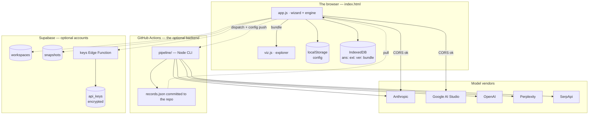

[← Answer Space](../README.md)

# Architecture

A static site with no server of its own, two interchangeable collection engines, and an
optional cloud that is additive rather than load-bearing.



---

## Two engines, one dataset

Both engines run the same four stages against the same profile and the same frozen query
set, and both emit the same schema-2 bundle. Which one you use is a function of which
channels you want, not of which features you get.

| | Browser engine (`app.js`) | Actions engine (`pipeline/`) |
|---|---|---|
| Runs where | your tab | GitHub's runner |
| Channels | Claude, Gemini | all five |
| Keys live in | `localStorage`, or your account | repo Actions secrets |
| Storage | IndexedDB per snapshot date | JSONL files under `pipeline/data/raw/` |
| Output | `bundle` in IndexedDB, downloadable | `records.json` committed to the repo |
| Runs while you're away | no | yes — Mondays 06:00 UTC, or on dispatch |
| Resumable | yes, by `aid` | yes, by `aid` |

The dashboard drives the second engine without you ever opening a terminal: **Trigger
workflow** pushes `profile.json`, `prompts.json` and `facts.txt` into the repo through the
GitHub contents API, *then* dispatches `collect.yml`. Pushing config first is the whole
point — otherwise the Action measures whatever was committed last rather than what you just
configured.

The CLI is also usable on its own:

```bash
cd pipeline
npm run profile -- --site example.com --about "the thing you actually sell"
npm run prompts
npm run collect  -- --repeats 3 --limit 20
npm run extract
npm run verify   -- --limit 60
npm run build            # → data/records.json
npm run serve            # serves the explorer next to it
```

`npm run all` chains them. Every stage is separately resumable, so a rate limit halfway
through `collect` costs you the calls in flight and nothing else.

## Storage layers

Three of them, written in a fixed order: **local first, cloud second**, so a failed sync can
never cost you a run.

| Thing | Signed out | Signed in |
|---|---|---|
| Vendor keys | `localStorage`, plaintext | AES-256-GCM in `api_keys`, **not** in `localStorage` |
| Profile, query set, ground truth, scan config | `localStorage` | `localStorage` **and** `workspaces` |
| Raw answers, extractions, verifications | IndexedDB, keyed `ans:`/`ext:`/`ver:` + date | IndexedDB **and** `snapshots.raw` |
| Built bundle | IndexedDB | IndexedDB — derived, never stored in the cloud |
| `records.json` | download, or the repo via Actions | unchanged |

Two details worth knowing:

- **The bundle is never stored server-side.** The cloud holds the same raw material the
  browser holds, per date, and any device rebuilds the bundle from it. One source of truth,
  no stale derived copy to reconcile.
- **A key is only stripped from `localStorage` once the account is confirmed to hold it**
  (`KEYS_SAVED`). Anything pending or failed stays local. Stripping first is how an earlier
  build managed to delete keys outright on reload.

## Accounts, and what they are not

Optional, off entirely when `config.js` has no `SUPABASE_URL`, and every cloud helper is a
no-op when signed out. What an account buys is a **timeline** — run history that survives a
cleared cache, and a setup that follows you between machines — plus keys that stop living in
`localStorage` in the clear.

What it does not buy is a server-side runner. Collection still happens in your tab, on your
keys, when you press the button. Nothing collects while you are away; that is what the
Actions path is for.

### Security model

- Every table is behind row-level security keyed to `auth.uid()`, enforced by Postgres
  rather than by the client. The publishable key in `config.js` is public by design — it
  identifies the project and grants nothing on its own.
- Vendor keys are encrypted by the `keys` Edge Function, whose master key lives only in that
  function's environment — not in the database, not in the browser. A database leak alone
  yields ciphertext. Only the last four characters are kept in clear, so the UI can show you
  which key is set.
- Signup creates a profile and an empty workspace via a `security definer` trigger, and both
  trigger functions have `execute` revoked from `public`, `anon` and `authenticated` so they
  cannot be reached over the REST API.

Provisioning, and the one secret you must set yourself, are in [../SETUP.md](../SETUP.md).

## Rendering

The explorer draws to a single 2D canvas — no WebGL, no chart library, no dependencies at
all. A hand-rolled projector, an orbit camera and a painter's-algorithm renderer, in `viz.js`.

Consequences worth stating: it starts instantly, it works offline, `answer-space-explorer.html`
can be built as one self-contained file (`npm run build:standalone`), and the whole thing is
readable end to end. It also means large datasets are bounded by fill rate rather than by
draw calls, which is why edge counts are capped when nothing is selected and uncapped the
moment you drill in.

## Files

```
index.html                     the dashboard and the explorer, one page
app.js / app.css               wizard, browser engine, storage, Actions dispatch
viz.js / viz.css               the explorer: model, scope, colour, 3D, views, controls
config.js                      which Supabase project accounts use (blank = accounts off)
cloud.js                       auth, sync, run history — no-ops entirely when signed out
supabase/migrations/           tables, RLS policies, signup trigger
supabase/functions/keys/       encrypts vendor keys; holds the master key
pipeline/src/run.js            the CLI: profile · prompts · collect · extract · verify · build
pipeline/src/channels/         one adapter per AI channel
pipeline/src/taxonomy.js       the controlled vocabularies (mirrored in app.js)
pipeline/src/extract.js        the two-readings extraction schema and the verifier
pipeline/src/sources.js        host → source type, authority, influence
.github/workflows/collect.yml  the Actions engine
build-standalone.mjs           inlines the explorer into one HTML file
records.json                   written by the Action; absent until the first run
```

---

[Creating a run](user-flow.md) · [The six views](visualisations.md) · [Angles](angles.md) · [The data model](data-model.md) · Architecture · [The vocabularies](taxonomies.md)
